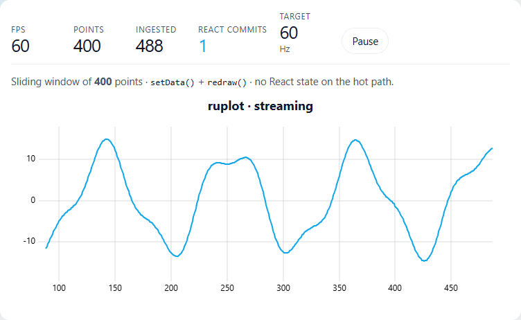
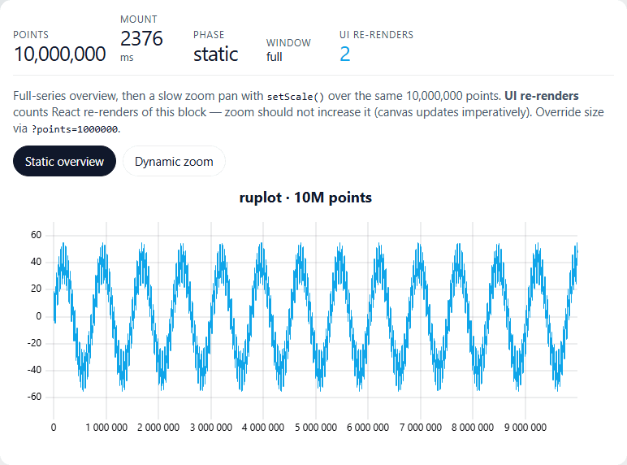
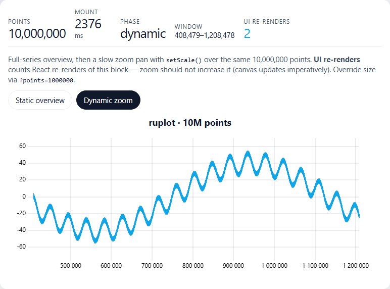

# ruplot

**React 18+ bindings for [uPlot](https://github.com/leeoniya/uPlot) that stay out of the way of the frame budget.**  
Repo `react-uplot-core` → npm [`@ruplot/react`](https://www.npmjs.com/package/@ruplot/react) + [`@ruplot/core`](https://www.npmjs.com/package/@ruplot/core).

At 60Hz streaming, typical wrappers commit React ~100+ times. **ruplot commits 0** — same FPS as raw uPlot.

**Requires React 18+** (19 recommended). No React 19-only APIs on the hot path.

[](https://www.npmjs.com/package/@ruplot/react)
[](https://github.com/Avoronov93/react-uplot-core/actions)
[](https://avoronov93.github.io/react-uplot-core/)
[](./scripts/check-size.mjs)
[](./LICENSE)

```bash
pnpm add @ruplot/react uplot
```

**Live demos:** [Storybook](https://avoronov93.github.io/react-uplot-core/) · Full prop tables: [Overview → API](https://avoronov93.github.io/react-uplot-core/?path=/docs/01-overview-api--docs)



---

## When to use / when not

**Use ruplot when** you need uPlot in React with frequent updates (stream / zoom / brush), care about React commit cost, or want composition (`Brush`, `Tooltip`, `Legend`, `SyncGroup`, plugins).

**Prefer something simpler when** charts are static one-shots, you are on React &lt; 18, or the team cannot keep `options` / `data` stable by reference on hot paths (`options={{…}}` every render forces extra classifier work and can recreate).

---

## Why not just wrap uPlot?

Most React wrappers either recreate the chart on “cheap” option changes, or push cursor / scales through React state and blow the commit budget while streaming.

| | raw uPlot | uplot-react | react-uplot | **ruplot** |
| --- | ---: | ---: | ---: | ---: |
| stream-60 **FPS** | 59.1 | 59.0 | 59.1 | **59.1** |
| stream React **commits** | 0 | 119 | 119 | **0** |

Same paint speed. Far less React work. Measured in CI on every release.

---

## Quick start

```tsx
import { Chart } from "@ruplot/react";
import uPlot from "uplot";
import "uplot/dist/uPlot.min.css";

const options: uPlot.Options = {
  width: 800,
  height: 300,
  series: [{}, { label: "Signal", stroke: "#0ea5e9" }],
};

export function App({ data }: { data: uPlot.AlignedData }) {
  return <Chart data={data} options={options} />;
}
```

Subscribe only when *your* UI needs it — moving the cursor does not re-render the chart tree:

```tsx
const idx = useCursor((c) => c.idx);
const x = useScales((s) => s.x);
```

```tsx
<Chart.SyncGroup id="plant">
  <Chart data={a} options={optsA}>
    <Chart.Brush value={range} onChange={setRange} panBand grips />
    <Chart.Legend />
    <Chart.Tooltip>
      {({ idx }) => (idx != null ? <span>{idx}</span> : null)}
    </Chart.Tooltip>
  </Chart>
  <Chart data={b} options={optsB} />
</Chart.SyncGroup>
```

Also: `Chart.AutoSize`, plugins, `useBrushStreamPolicy`, `streamingWindow`.

---

## Mental model

```
React props ──► classify ──► commands ──► ChartSession ──► uPlot
                 │                              │
                 │                              ├── stores (cursor / scales / …)
                 │                              └── no Context re-renders for 60Hz paths
                 └── identity → value → targeted patch / recreate
```

**Rules on the hot path**

- Keep `options` and `data` **stable by reference** (`useMemo` / module scope).
- Treat `data` columns as **immutable** — pass a new series ref (or `streamingWindow`). Dev warns on in-place mutation.
- Dev observability: `<Chart debug />` or `RUPLOT_DEBUG=1` → `ref.getDebugSnapshot()`.

### What updates without remounting

| Change | Path |
| --- | --- |
| `data` (new series refs) | `setData` |
| `stroke` / `width` / `dash` / `fill` / `spanGaps` | `patchSeries` |
| size | `setSize` |
| axis `values` / `label` (formatters) | slotted — no remount |
| `series.paths`, axis `side`, plugin list, `title`, … | **recreate** + restore zoom/cursor |

---

## Migration

### From [`uplot-react`](https://www.npmjs.com/package/uplot-react)

```tsx
// before
import UplotReact from "uplot-react";
<UplotReact options={options} data={data} onCreate={onReady} resetScales={false} />

// after
import { Chart } from "@ruplot/react";
<Chart data={data} options={options} onReady={onReady} streaming={{ enabled: true, follow: true }} />
```

| uplot-react | ruplot |
| --- | --- |
| `onCreate` / `onDelete` | `onReady` + unmount destroys the session |
| `resetScales` | `resetScales` prop, or `streaming` (defaults preserve zoom) |
| `target` | omit — Chart owns the DOM node |
| cursor UI via React state | `useCursor` / `Chart.Tooltip` (keeps commits off the hot path) |

Keep `options` stable. Compare commits in Storybook **Compare → Streaming**.

### From [`react-uplot`](https://www.npmjs.com/package/react-uplot) / similar thin wrappers

Same shape: swap the wrapper for `<Chart data options />`. Move any `useState` for cursor / hover off the chart tree into `useCursor` or `Chart.Tooltip`. Prefer `streaming` over manually calling `setData` + scale resets on every tick.

### From raw uPlot

```tsx
// before
useEffect(() => {
  const u = new uPlot(options, data, el);
  return () => u.destroy();
}, []);
// then imperative setData / setScale yourself

// after
<Chart data={data} options={options} />
// classifier picks setData / setSize / patchSeries / recreate
```

Escape hatches: `ref.current.getInstance()`, `useUPlot()`, or `session.apply([...])` for advanced hosts. Prefer letting the classifier run over `new uPlot` on every prop change.

---

## API stability (0.3)

| Import | Status |
| --- | --- |
| `@ruplot/react` | **stable** — Chart, composition, hooks, common helpers |
| `@ruplot/react/unstable` | **unstable** until 1.0 — workers, `createDataPlane`, sync rebind |
| `@ruplot/core` | engine — session, classifier, stores |

```ts
import { Chart, streamingWindow } from "@ruplot/react";
import { streamingWindowTransferable } from "@ruplot/react/unstable";
```

**SSR:** `createChartStores()` once → HUD via `getServerSnapshot` → same object as `<Chart stores={stores} />` after hydrate. Demo: [SSR hydrate](https://avoronov93.github.io/react-uplot-core/?path=/story/03-updates-ssr-hydrate--playground).

Prop tables & recipes live in [Storybook API](https://avoronov93.github.io/react-uplot-core/?path=/docs/01-overview-api--docs) and interactive demos (streaming, brush, sync, workers).

---

## Large data




---

## Packages

| Package | Use when |
| --- | --- |
| [`@ruplot/react`](https://www.npmjs.com/package/@ruplot/react) | React apps — start here |
| [`@ruplot/core`](https://www.npmjs.com/package/@ruplot/core) | Non-React hosts / custom bindings |

---

## License

MIT
